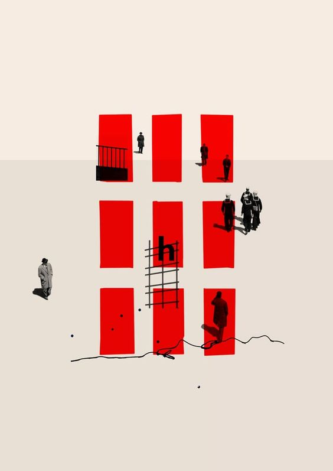

I stumbled upon this illustration by [Christiana Couceiro](https://cristianacouceiro.com/), and I quite liked it. I also noticed it had a modularity to it that I thought could make a good model for a piece of procedural generation.

<a href='#.button' onclick="window.location.reload(true);">
  
    Generate a New Illustration
  
</a>

  

  
  {: .w-full}
  **Original Illustration** by [Cristiana Couceiro](https://cristianacouceiro.com/)
  

  

<script src="illustration.js" >

