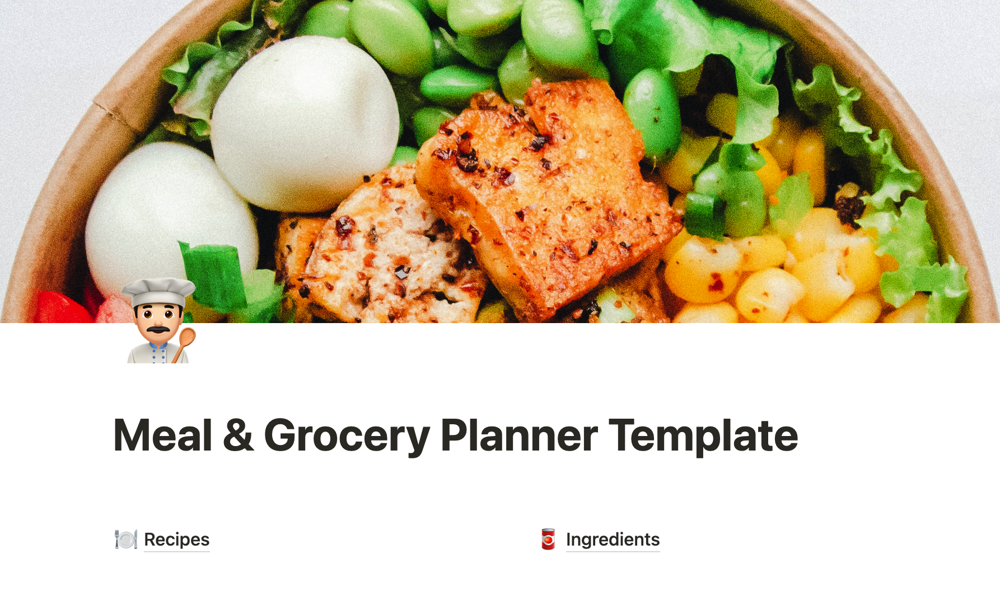

**Link:** [Meal & Grocery Planner Template](https://meyershire.notion.site/Kitchen-Template-800c98b0788945dfa397691311499ea9){:target="_blank"}

Meal planning and grocery shopping can be a hassle. It takes time to search for recipes, create a shopping list, and go to the store. If you don't plan ahead, you may end up wandering the store, buying unnecessary items and forgetting what you actually need; wasting time and money. I want to share a tool I created in Notion to streamline this process for my household.

This template has two databases: Recipes and Ingredients. A Recipe has three fields: a text field for the name, a relation field to the Ingredients database, and a select field for the day it will be cooked (for meal planning). At minimum, you name the recipe and list the ingredients needed to prepare it in the Ingredients relation field. You can also add details about the recipe's preparation in the body of the note. When you add ingredients, categorize them by the section of the store you will find them: produce, meat, canned goods, etc. For an optimal shopping experience, arrange the category options in the order that you will encounter them in the store. For example, if you typically start in the produce section, then move on to the meat, and then the dairy case, rearrange the categories accordingly.

Once you've compiled a collection of recipes, it's time to start planning your meals. Using the Weekly Plan view of the Recipes database, drag and drop recipes onto the days of the week that you plan to prepare them.

Now that you have your meals planned, it's time to create your shopping list. Use the This Week's Ingredients view of the Ingredients database to see all the ingredients you need for the week. Check off any ingredients that you already have. As you shop, use the Grocery Shopping List view and check off items as you add them to your cart to keep track of what you still need and to prevent forgetting important items.

Using this Notion template to meal plan and make a shopping list has several benefits. It saves time by allowing you to quickly search and reference your recipes, helps you save money by allowing you to plan your meals in advance and only buy what you need, and saves time by streamlining the shopping process and avoiding mid-week trips to the store for forgotten items.

I hope this template helps you!
**Link:** [Meal & Grocery Planner Template](https://meyershire.notion.site/Kitchen-Template-800c98b0788945dfa397691311499ea9){:target="_blank"}