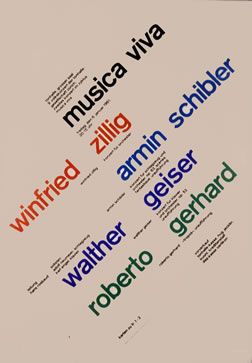

<h2>recreating a design classic</h2>

  

    
This is a recreation of a poster work by Josef Müller-Brockmann on behalf of musica viva. Creating a responsive version of this design requires careful attention to detail. The task involves leveraging CSS grids and flexbox to preserve the spatial arrangement ensuring that the layout maintains its integrity on different screens. This means that as the viewport changes size the text elements must reposition smoothly keeping their deliberate stagger and angle without losing the interactive dance between the elements.

     
    
The goal is to maintain legibility and visual impact, scaling elements proportionately ensuring that the design's essence is communicated effectively no matter the device, striking a balance between the fluidity of responsive design and staying true to the original artistic intent.

     
    <i>Resize your browser window for the full effect.</i>
  

  

    
    <small>The Müller-Brockmann Original</small>
  

  

    <!-- row 1 -->
    

    
a recreation of a poster work by Josef Müller-Brockmann on behalf of musica viva

    

    <!-- row 2 -->
    

    <h1 class='col-span-6'>design viva</h1>
    <!-- row 3 -->
    

    
creating a responsive version of this design

    

    <!-- row 4 -->
    

    <h1 class='col-span-4 red'>bobby</h1>
    <h1 class='col-span-6 red'>meyer</h1>
    <!-- row 5 -->
    

    
requires careful attention to detail

    
the task involves leveraging CSS grids

    

    <!-- row 5 -->
    <h1 class='col-span-6'></h1>
    <h1 class='col-span-6 blue'>designer</h1>
    <!-- row 6 -->
    
 and flexbox to preserve the spatial arrangement

    
ensuring that the layout

    
 maintains its integrity

    
 on different screens

    

    <!-- row 6 -->
    

    <h1 class='col-span-4 indigo'></h1>
    <h1 class='col-span-6 indigo'>developer</h1>
    <!-- row 6 -->
    

    
this means that as the viewport changes size

    
the text elements must reposition smoothly

    

    <!-- row 7 -->
    <h1 class='col-span-1 green'></h1>
    <h1 class='col-span-1 green'>⌘</h1>
    <h1 class='col-span-3 green'>pixels</h1>
    <h1 class='col-span-1 green'>&</h1>
    <h1 class='col-span-6 green'>bits</h1>
    <!-- row 8 -->
    

    
keeping their deliberate stagger and angle

    
without losing the interactive dance between the elements

    

    <!-- row 9 -->
    

    
the goal is to maintain legibility and visual impact

    
scaling elements proportionately ensuring that the design's essence is communicated effectively

    
no matter the device

    
striking a balance between the fluidity of responsive design and staying true to the original artistic intent

    

